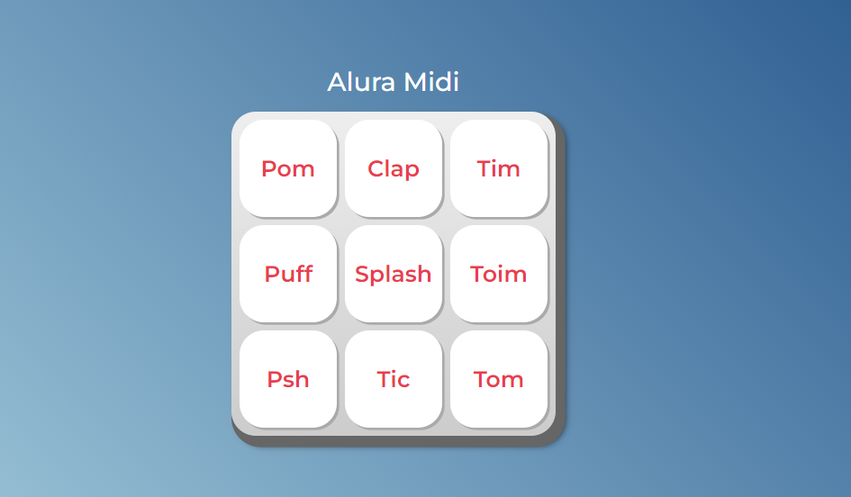

<h1 align="center">

</h1>


<h1 align="center">
Alura Midi
</h1>

# Indice


- [Sobre](#-sobre)
- [Tecnologias utilizadas](#💻-tecnologias-utilizadas)
- [Como baixar o projeto](#📥-como-baixar-o-projetocomo-baixar-o-projeto)

___

## 📋Sobre


O Alura Midi é um instrumento musical de interface digital, onde a cada botão vamos reproduzir o som de um instrumento.
___


## 💻Tecnologias utilizadas 


O exercício foi desenvolvido utilizando as seguintes tecnologias:

- HTML
- CSS
- JavaScript

___

## 📥 Como baixar o projeto

```bash
    # Clonar o repositório
    $ git clone 
```
